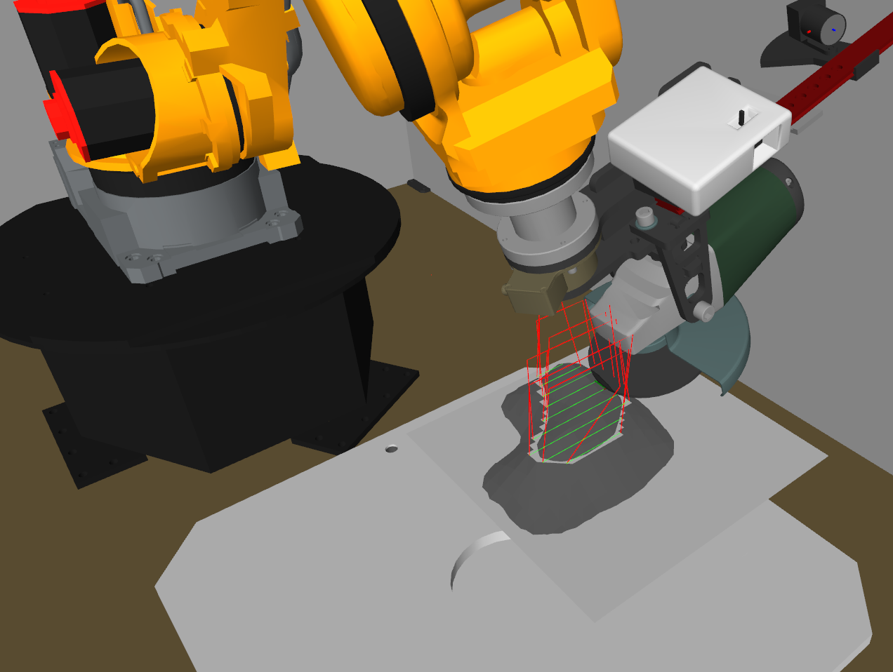

 [](http://www.institutmaupertuis.fr) Bezier
===

ROS-Industrial Special Project: 6D tool path planner

[Pierre Étienne Bézier](https://en.wikipedia.org/wiki/Pierre_B%C3%A9zier) September 1, 1910 – November 25, 1999; *was a French engineer and one of the founders of the fields of solid, geometric and physical modeling as well as in the field of representing curves, especially in CAD/CAM systems. As an engineer at Renault, he became a leader in the transformation of design and manufacturing, through mathematics and computing tools, into computer-aided design and three-dimensional modeling. Bézier patented and popularized, but did not invent the Bézier curves and Bézier surfaces that are now used in most computer-aided design and computer graphics systems.*

Travis CI
===

Indigo | Kinetic |
--|--|
[](https://travis-ci.org/ros-industrial-consortium/bezier) |
[](https://travis-ci.org/ros-industrial-consortium/bezier) |

General information
-------------------
This project has been developed by the [Institut Maupertuis](http://www.institutmaupertuis.fr), a French research institute that is working on robotic industrial processes.
This project goal is to create an automatic grinding path generator for 6-axis robots working on diverse/random meshes.

Bezier planner generates robot poses (3D trajectories) in harmony with a grinding process.
It is able to create rectilinear trajectories on complicated surfaces (3D surfaces) and to dilate them in all directions in order to grind defects with a pass principle.



[](https://www.youtube.com/watch?v=aLp8zxx1PnU)
Click the image to see a video of a Fanuc robot grinding thanks to the Bezier library, the project is [fanuc_grinding](https://github.com/InstitutMaupertuis/fanuc_grinding).

Directories in the project
--------------------------

| Directory  | Description
------------ | -----------
`bezier` | Meta-package
`bezier_application` | Example usage of the `bezier_library` package on a Fanuc robot
`bezier_library` | Library containing several path planning algorithms

Dependencies
------------
- [Robot Operating System](http://wiki.ros.org/ROS/Installation)
- [`industrial-core`](http://wiki.ros.org/industrial_core)
- [`fanuc`](http://wiki.ros.org/fanuc)
- [`rviz_visual_tools`](https://github.com/davetcoleman/rviz_visual_tools)
- [`Visualization Toolkit`](https://gitlab.kitware.com/vtk/vtk/) version `7.0` or later
- [`Point Cloud Library`](https://github.com/PointCloudLibrary/pcl) version `1.8.0` or later. :warning: PCL has to be compiled against the same VTK version that is used for this package
- `C++11` is required 

This package has been tested with the following setups:
- `indigo-devel` branch: Ubuntu 14.04 and ROS Indigo.
- `kinetic-devel` branch: Ubuntu 16.04 and ROS Kinetic.

Documentation
-------------
Please read [bezier_library/doc/README.md](bezier_library/doc/README.md).

Quick help
----------

**Build using [wstool](http://wiki.ros.org/wstool) and [catkin_tools](http://catkin-tools.readthedocs.io/en/latest/)**

Install wstool in order manage the repos inside the workspace
```bash
sudo apt-get install python-wstool
```

```bash
mkdir -p catkin_workspace/src
cd catkin_workspace/src
```

```bash
wstool init .
wstool merge https://github.com/ros-industrial-consortium/bezier/raw/kinetic-devel/bezier.rosinstall
wstool update
rosdep install --from-paths . --ignore-src
cd ..
catkin build
```

If you have troubles with `rviz_visual_tools` not finding Eigen, please revert this commit [rviz_visual_tools/commit/425d208b2719cafeae3e4f3ccdd6b44853400a32](https://github.com/davetcoleman/rviz_visual_tools/commit/425d208b2719cafeae3e4f3ccdd6b44853400a32) in the `rviz_visual_tools` clone.

**Launch**

Source the `devel/setup.bash` file and launch the surfacing application:
```bash
roslaunch bezier_application fanuc_m20ia_surfacing.launch surfacing_mode:=true mesh_cad:=plane/plane_defect.ply
```
Use the following command for the painting application: 
```bash
roslaunch bezier_application fanuc_m20ia_painting.launch mesh_cad:=ocean/ocean.ply 
```

In this example, `bezier_application` will be launched with `plane_defect.ply` as the CAD mesh and the grinding will be done in surface mode, meaning that we only pass on the surface of the mesh to smooth it.

```bash
roslaunch bezier_application fanuc_m20ia_surfacing.launch mesh_cad:=plane/plane.ply mesh_defect:=plane/plane_defect.ply
```

In this example, `bezier_application` will be launched with `plane.ply` as the CAD mesh and `plane_defect.ply` as defect mesh.

Others examples of meshes are available in:
```bash
$(catkin_workspace)/src/bezier/bezier_application/meshes
```

