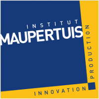

Bezier
======

ROS-Industrial Special Project : 5D tool path planner

[Pierre Étienne Bézier Pierre](https://en.wikipedia.org/wiki/Pierre_B%C3%A9zier) September 1, 1910 – November 25, 1999; *was a French engineer and one of the founders of the fields of solid, geometric and physical modeling as well as in the field of representing curves, especially in CAD/CAM systems. As an engineer at Renault, he became a leader in the transformation of design and manufacturing, through mathematics and computing tools, into computer-aided design and three-dimensional modeling. Bézier patented and popularized, but did not invent the Bézier curves and Bézier surfaces that are now used in most computer-aided design and computer graphics systems.*


Description
-----------



This project has been developed by the [Institut Maupertuis](http://www.institutmaupertuis.fr), a French research institute that is working on robotic industrial processes.
This project goal is to create an automatic grinding path generator for 6-axis robots working on diverse/random meshes.

Bezier planner generates robot poses (3D trajectory) in harmony with a grinding process.
It is able to create rectilinear trajectories on complicated surfaces (3D surfaces) and to dilate them in all directions in order to grind default with a pass principle.


Launch example
--------------

**Build:**
```bash
cd $(ros_repository)/build && make
```

**Launch:** 
```bash
roslaunch bezier_application bezier_application.launch filename:=oriented_complicated_mesh.ply
```

In this example, `bezier_application` will be launch with `oriented_complicated_mesh.ply` as input mesh and `oriented_complicated_mesh_default.ply` as default.

Others examples of meshes are present in
```bash
$(ros_repository)/src/bezier/bezier_application/mesh
```

Dependencies
------------

- ROS indigo version (with the [Fanuc package](https://github.com/ros-industrial/fanuc))
- A ([patched](https://gitlab.kitware.com/vtk/vtk/merge_requests/213)) version of VTK. The patch ensures the continuity of the VTK stripper, output of the VTK slicing process.
- The [Point Cloud Library](https://github.com/PointCloudLibrary/pcl) version 1.8 or trunk

Bezier has been tested with ROS Indigo under Ubuntu 14.04.

Documentation
-------------

Doxygen documentation: 
```bash
$(ros_repository)/build/bezier/bezier_library/html/index.html
```

Contents 
--------

- `bezier`: meta-package
- `bezier_library`: library containing several functions for robotic grinding
- `bezier_application`: example of `bezier_library`
- `Documentation`: explication of `bezier_library`'s goal and principle 

Input / output
--------------

**Input:** an input mesh (PLY file), a default mesh (PLY file) and several parameters for grinding (depth, diameter of the effector, percentage of covering,
     frequency of extrications and their depth).

**Output:** vector of robot poses (quaternions and positions)

