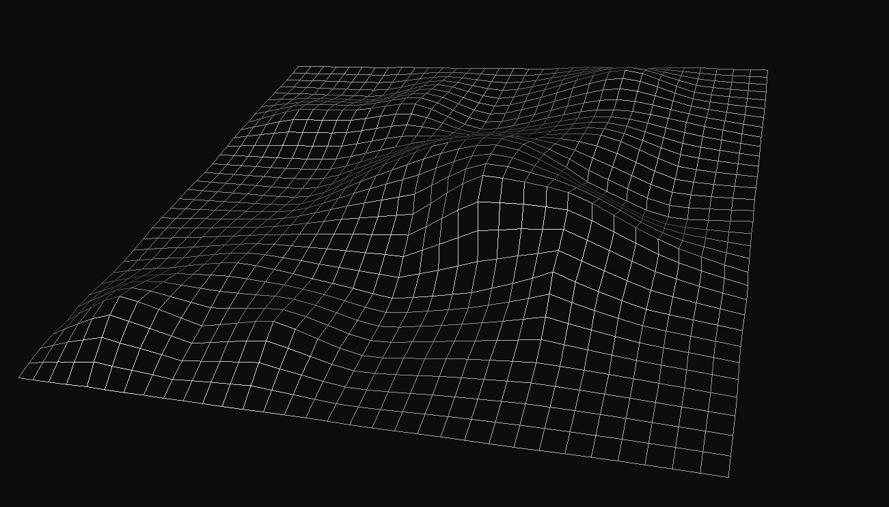
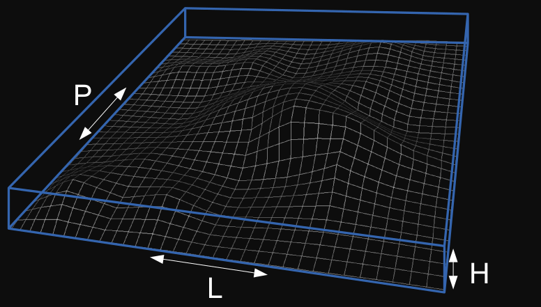
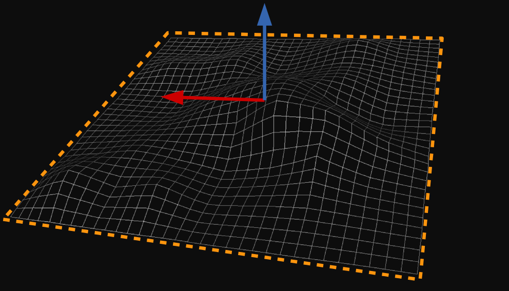
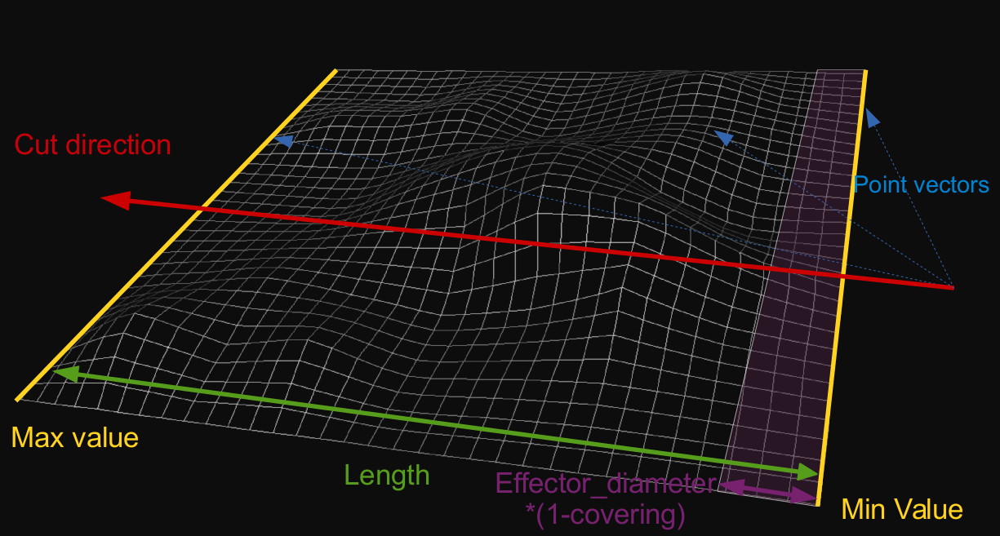
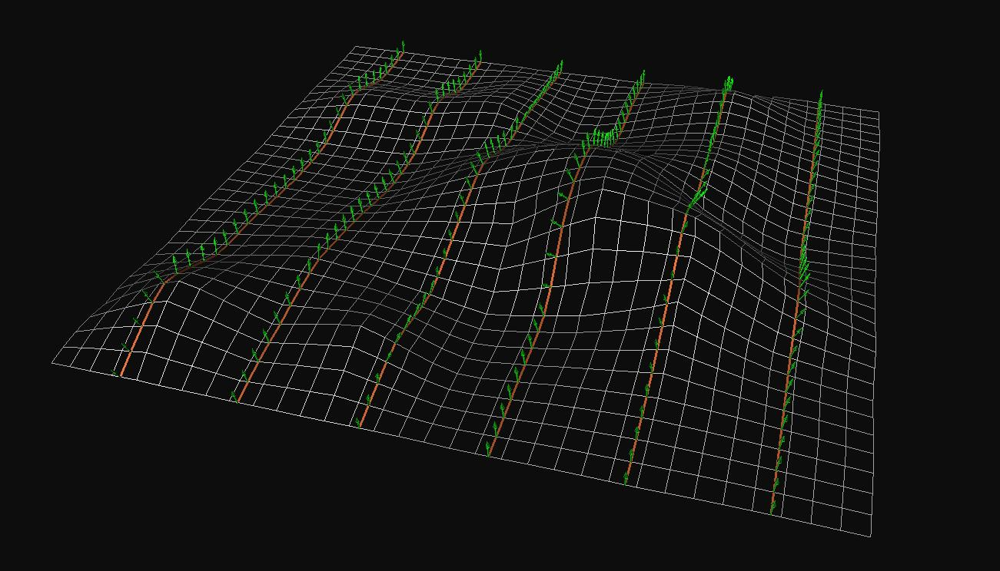
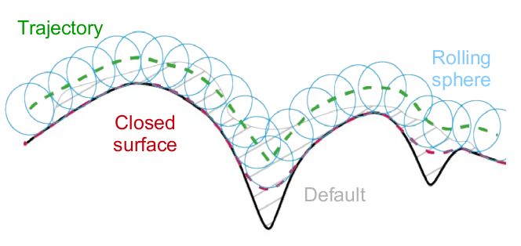
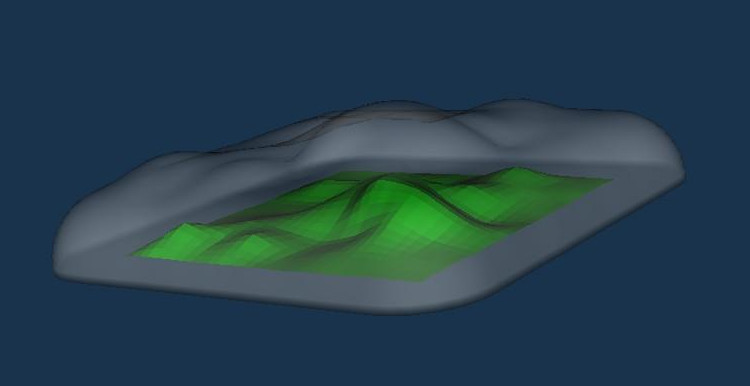
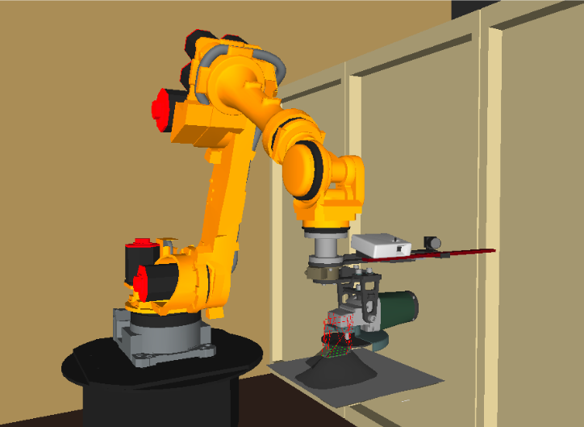
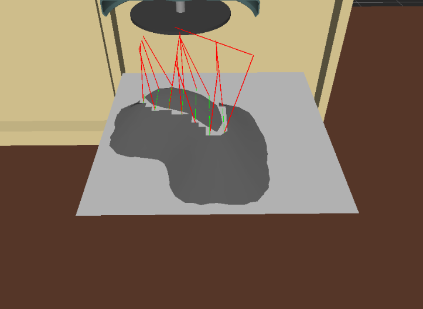

How to build the API documentation
==================================
```bash
cd $(catkin_workspace)/build
make bezier_library_doc
```

Goals
=====
Design a fully automated robotized grinding application

Functions
- F1: Being able to locate the part (different shapes, only coarse location is known, small batches)
- F2: Ensure a constant material removal rate (CAM)
- F3: Being able to respect the manufacturer's specifications (dimensions, manage tool wear)

Automatically grind defects on a mechanical part thanks to:
- A robot
- 3D vision

Defects types
- Shocks, deformations, welding spatters, weld bead ...
- Surface roughness

Numerical blocks
================
3D -> 3D sensor -> 3D scanning -> 3D metrology -> Robot path planning -> Grinding

How Bézier works
================
Input
-----
An input mesh (PLY file), a default mesh (PLY file) and several parameters for grinding (depth, diameter of the effector, percentage of covering, frequency of extrications and their depths).

| Parameters | Description
------------ | -----------
`maximum_depth_of_pass_` | Maximum depth machining (in meters)
`effector_diameter_` | Diameter of the end effector (in meters)
`covering_percentage_` | Percentage of covering (from 0.0 to 1.0)
`extrication_coefficient_` | Extrication depth equal of the percentage of `maximum_depth_of_path_` (coefficient)
`extrication_frequency_` | New extrication mesh generated each one `extrication_frequency_` times



1. Planar segmentation
----------------------
RANSAC using PCL.

Parameters:
- Threshold
- Mesh size

             | 
------------------------------------------- | ------------------------------
Threshold equal to max length of mesh sides | Segmented plan and mesh normal

2. Slicing direction
--------------------
The slicing direction is a vector that belongs to the segmented plan


3. Number of slices
--------------------
The number of slices is equal to the length of the mesh divided by the effector diameter * (1 - covering)


4. Mesh normals
---------------
Local mesh normals are estimated to determine the tool orientation


5. Robot poses
--------------
Consistently oriented robot poses are generated for each point of the trajectory


6. Dilation
-----------
To generate different passes, the input mesh is dilated and the process is repeated until the defect if fully covered




Output
------
Robot poses and trajectories



