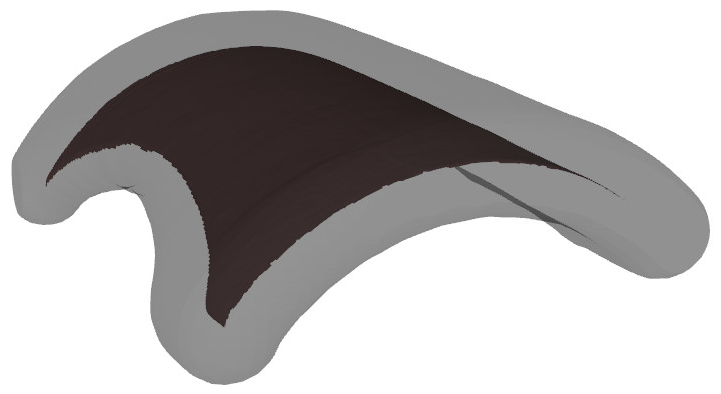
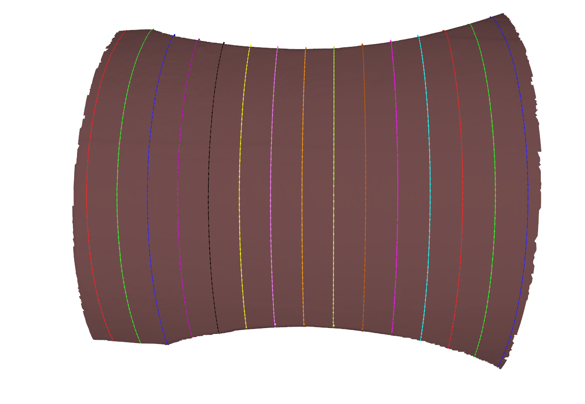
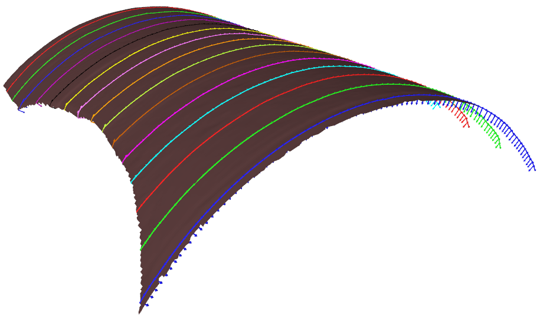
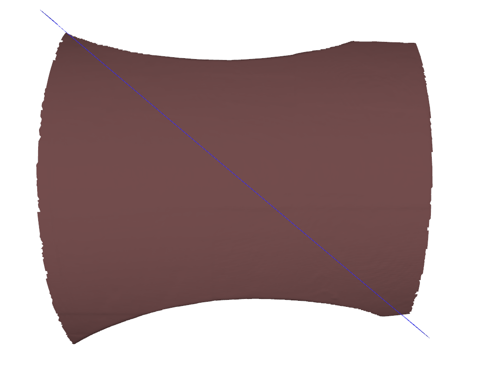
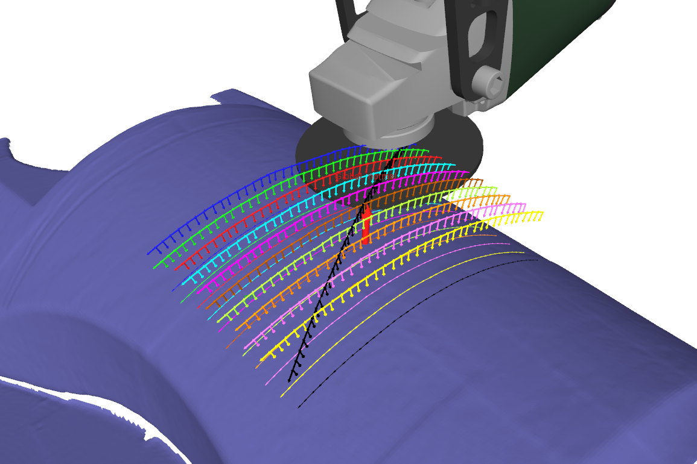

  BezierGrindingSurfacing
===

`BezierGrindingSurfacing` is a class derivated from `Bezier` class.
This class allows to generate trajectories on a mesh like CAM surfacing.

In this mode we do not need the CAD of the object we want to surface, we only need the scan mesh of the part.

Principle: Generation of trajectories
===
Each chapter of this section describes step-by-step how the trajectory is genrerated.

1. Validate parameters
---
This function checks if the input parameters (tool width, covering percentage) are correct.

2. Estimate slicing orientation
---
[estimateSlicingOrientation](README_estimate_slicing_orientation.md) returns a slicing orientation that is going to be used to cut the mesh (with planes) and extract trajectories.

_The global normal is displayed with a red arrow, the blue arrow represents the slicing orientation_

3. Dilate
---
[dilate](README_dilate.md) operates a morphological dilation on a mesh and returns the dilated mesh.

_The dilated mesh is represented in grey (transparent), the scan mesh is represented in brown_

This process is used to create extrication passes, in order to avoid collisions with the part (scan mesh).

4. Keep upper part of dilated mesh
---
[keepUpperPartOfDilatedMesh](README_keep_upper_part_of_dilated_mesh.md) filters the "lower" part of a dilated mesh to keep only the triangles on the exterior of the part.

5. Compute normals
---
[computeNormals](README_compute_normals.md) makes sure we have all the normals data available for the future operations. The normals are computed both on the input and dilated meshes.

6. Estimate slicing planes: Grinding
---
[estimateGrindingSlicingPlanes](README_estimate_grinding_slicing_planes.md) computes the total number of lines needed to surface the entire mesh and generates all the matching planes equations.

7. Slice mesh with planes: Grinding
---
[sliceMeshWithPlanes](README_slice_mesh_with_planes.md) slices the mesh given the plane equations to extract multiple lines. This operation generates all the grinding lines.

8. Generate robot poses along stripper: Grinding
---
[generateRobotPosesAlongStripper](README_generate_robot_poses_along_stripper.md) generates a robot grinding trajectory along a line. The trajectory is a succession of poses (isometry matrix).

9. Harmonize line orientation: Grinding
---
[harmonizeLineOrientation](README_harmonize_line_orientation.md) makes sure that all the grinding lines have the same orientation.

10. Apply lean angle: Grinding
---
[applyLeanAngle](README_apply_lean_angle.md) orients the grinding tool given the user parameters.

11. Estimate extrication slicing plane: Extrication
---
[estimateExtricationSlicingPlane](README_estimate_extrication_slicing_plane.md) computes the plane equation needed to generates an extrication line between two grinding lines. This function is called in a loop thus generating all the equations needed to for all the extrications trajectories (except the last one, see below)

12. Slice mesh with planes: Extrication
---
[sliceMeshWithPlanes](README_slice_mesh_with_planes.md) calls the function `sliceMeshWithPlane` to cut the mesh successively using different planes equations along the slicing orientation.
This operation generates all extrications lines which are then converted to robot trajectories.

13. Generate robot poses along stripper: Extrication
---
[generateRobotPosesAlongStripper](README_generate_robot_poses_along_stripper.md) generates a robot extrication trajectory along a line. The trajectory is a succession of poses represented by an orientation and a position in the 3D space.

14. Invert X axis of poses: Extrication
---
[invertXAxisOfPoses](README_invert_x_axis_of_poses.md) reverse the x axe of the extrications poses thus allowing to keep the tool with the same orientation than the grinding lines on the extrications trajectories.

15. Harmonize line orientation: Extrication
---
[harmonizeLineOrientation](README_harmonize_line_orientation.md) checks that all extrications line are correctly oriented. It acheive that by comparing the orientation of the line to a vector of reference.

16. Filter extrication trajectory: Extrication
---
[filterExtricationTrajectory](README_filter_extrication_trajectory.md) filters the extrications trajectories. It allows to avoid having poses which are inaccessible for the robot.

17. Estimate slicing plane: Last extrication pass
---
[estimateExtricationSlicingPlane](README_estimate_extrication_slicing_plane.md) computes the plane equation needed to generate the last extrication line which goes from the last point of the last grinding line to the first point of the first grinding line.

18. Slice mesh with planes: Last extrication pass
---
[sliceMeshWithPlanes](README_slice_mesh_with_planes.md) calls the function `sliceMeshWithPlane` to cut the mesh. This operation generates the last extrication line.

19. Generate robot poses along stripper: Last extrication pass
---
[generateRobotPosesAlongStripper](README_generate_robot_poses_along_stripper.md) generates the last extrication trajectory along a line. The trajectory is a succession of poses represented by an orientation and a position in the 3D space.

20. Harmonize line orientation: Last extrication pass
---
[harmonizeLineOrientation](README_harmonize_line_orientation.md) checks that the last extrication line is correctly oriented. It acheive that by comparing the orientation of the line to a vector of reference which goes from the last point of the last grinding line to the first point of the 
first grinding line.

21. Filter extrication trajectory: Last extrication pass
---
[filterExtricationTrajectory](README_filter_extrication_trajectory.md) filters the last extrication trajectory. It allows to avoid having poses which are inaccessible for the robot.

22. Invert X axis of poses: Last extrication pass
---
[invertXAxisOfPoses](README_invert_x_axis_of_poses.md) reverse the x axe of the last extrication trajectory poses thus avoiding the tools to make a PI rotation on himself to reach the initial start point.

23. Result
---
After all these steps, here is the result given on a little part of an input mesh:

