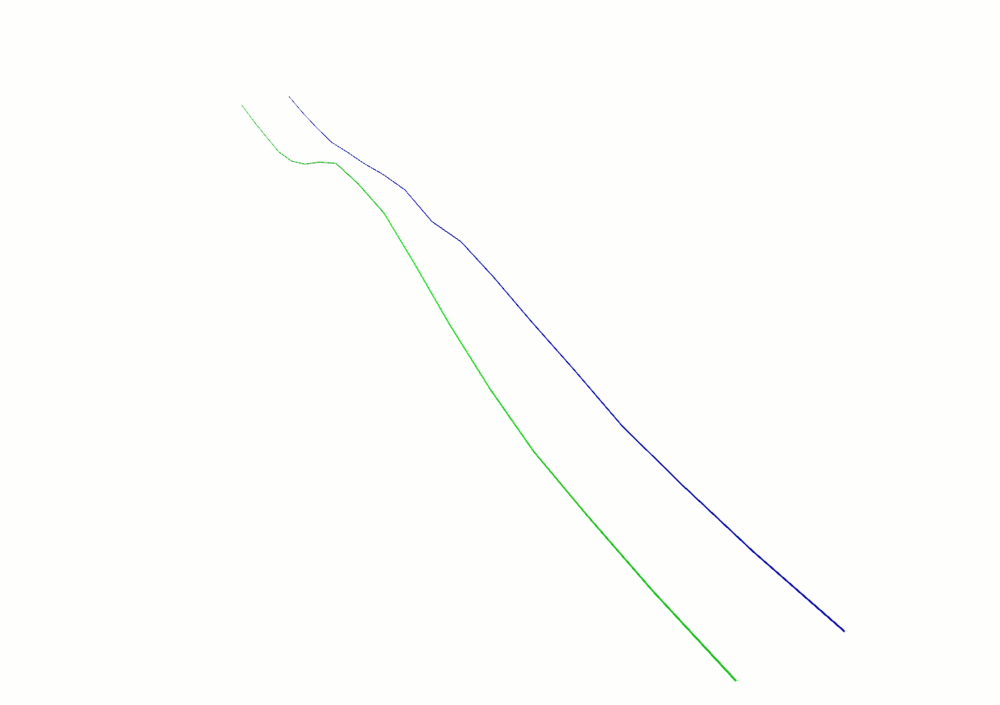

  estimateExtricationSlicingPlane
===

This function determines the number of lines needed to generate our extrication trajectories along the dilated mesh. It has the same behavior as [estimateGrindingSlicingPlanes](README_estimate_grinding_slicing_planes.md), it finds a plane equation to slice the mesh and return a line.

To find a plane equation this algorithm defines a triangle :
- Point 1: Last point of the current line
- Point 2: First point of the next line
- Point 3: The last point of the current line with an offset along the global mesh normal.

These 3 points forms a plane which is returned as the result.

The following animation shows the result when this function is used to generate an extrication path : 

_Blue line is the current grinding line, green line is the next grinding line, red line is the extrication line_
