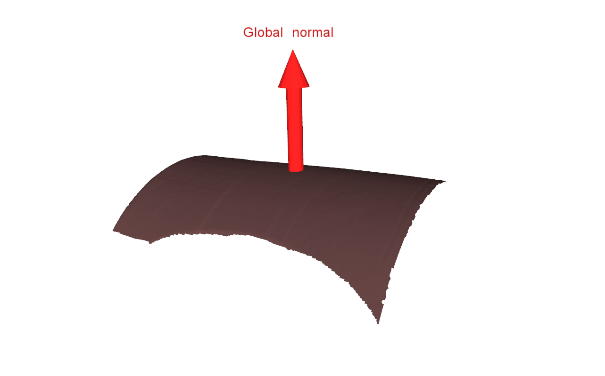

  estimateGlobalMeshNormal
===

This function computes a global normal of a [vtkPolyData](http://www.vtk.org/doc/release/7.0/html/classvtkPolyData.html) using the [RANSAC method application]() of the [PCL library](). The RANSAC method allows to segment a plane into a point cloud. The threshold parameter provided to RANSAC is the highest value between the width, the length and the height of the bounding box of the cloud. Once a plane is obtained, the global normal is set to be the segmented plane normal vector.

The following picture illustrates the result of a global normal computation : 

