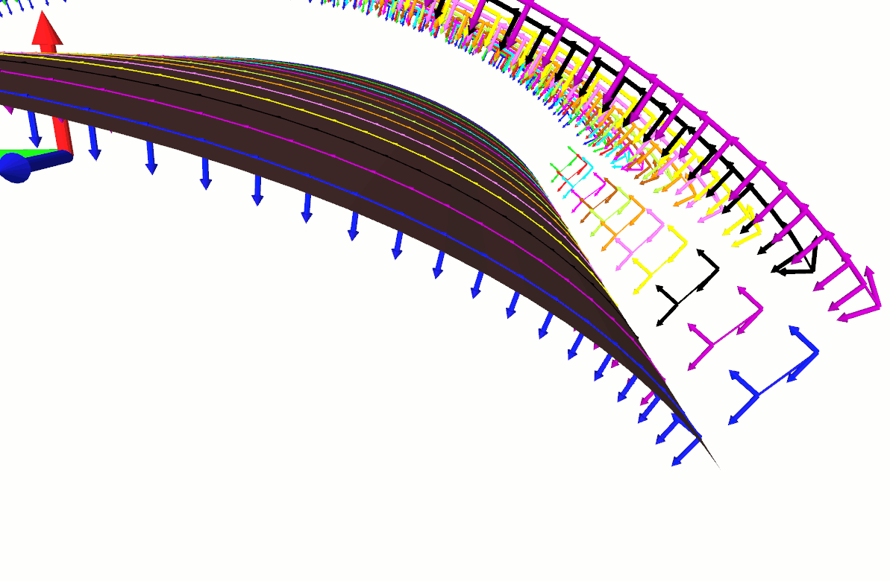
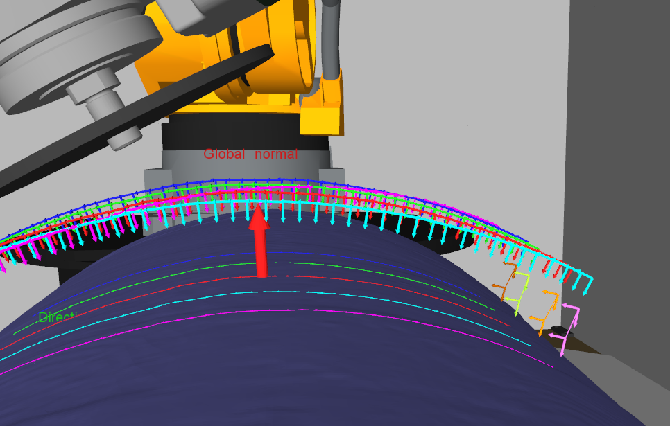

  generateRobotPosesAlongStripper
===

This function generates a specified number of point between a start and an end point along a line.
Each point is located at an equally far away position of his predecessor and generated using the formula : `Point = StartPoint + d*LineVector`
with `d` the distance between the start point and the generated point and `LineVector` the vector between the
start point and the end point of the line. 

The following animation illustrates the generation of the intermediate poses :

The following picture illustrates the result of the process :

 
