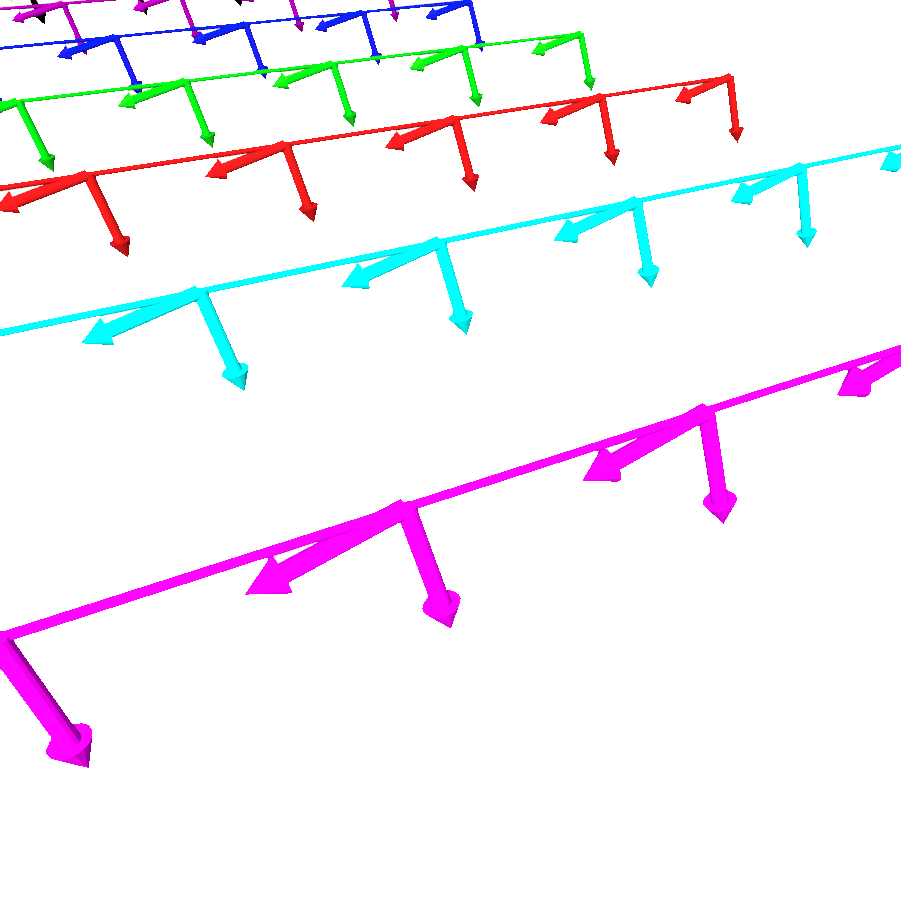
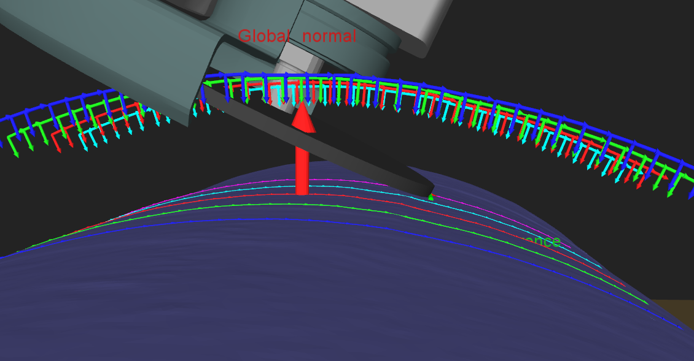

  applyLeanAngle
===

The grinding tool must approach the processed object with a certain angle of attack. For each pose of the trajectory the angle is applied on either X, Y or Z axis.

This angle is defined by the parameters `lean_angle_` and `axis_of_rotation_`.

The following animation shows the effect of the lean angle on the robot poses :

The following image shows the grinder angle when grinding :

