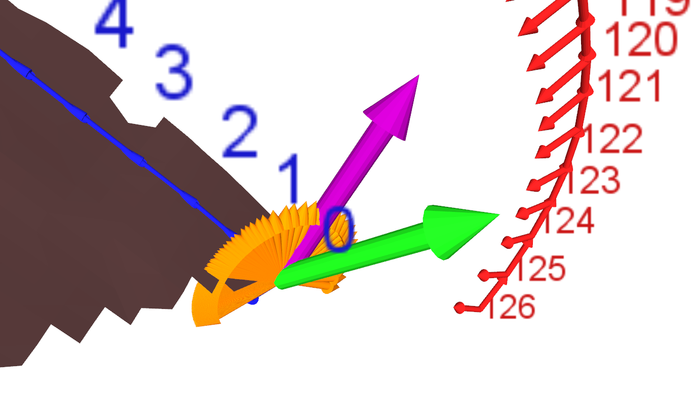
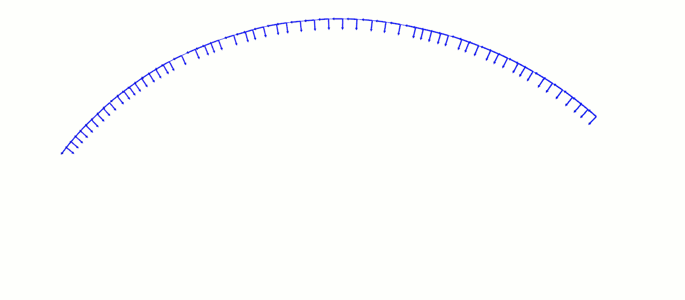

  filterExtricationTrajectory
===

The purpose of this function is to remove poses located on each extremum of an extrication trajectory.

The extrication filter compares signed 2D angles to reject inaccessible points from the extrication trajectory.
The filter applies the comparison algorithm on both ends of the extrication trajectory :

	At the beginning of the trajectory, it takes the normal (Nor) of the last grinding point of the current grinding line (GN)
	and make a projection of this vector onto the plane used to slice the mesh and generate the extrication trajectory.
	It then computes a vector (AN) between the last grinding point A a extrication point N. Thanks to the projection made before,
	the normal (Nor) and the vector (AN) are located into the same 2D plane. An angle computation it's performed.
	The sign of the first angle computed is taken as reference. The operation is then repeated with the
	following points (N+1, N+2 ...) as long as the current angle computed has the same sign than the reference angle.
	A change of sign occur when we reach a point (T) located just above the grinding point, thus
	accessible for the robot. Finally all the point located before (T) are removed from the trajectory.
	The same process is repeated at the end side of the trajectory, but the normal (Nor) is the normal at the first point of the
	next grinding line (GN +1) trajectory.

The formula used to project the vector is : `A - (A.n)n` with A the vector to project and n the normal of the plane.
The computation of the 2D angle done using : `arctan(determinant, (dot product between A and n))`

The following picture shows the projection (purple arrow) of the normal (Nor, green arrow) onto the plane used to generate the extrication trajectory :

The following picture shows the reference vector (projection of the normal Nor, purple arrow) and all the vectors AN, A(N+1), A(N+2) ... (orange arrows) used to computes
the 2D angles : 

The following animation shows the result when the filter is applied : 

