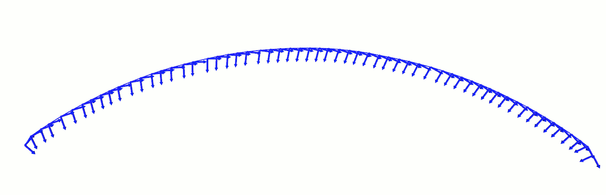

  filterNeighborPosesTooClose
===

This function filter a trajectory by down sampling It. It will remove points which are to close from each other.
The pattern used to acheive that is :
- We select a valid point P(N) on the trajectory
- We compute the distance between the point P(N) and his neighbor P(N + 1). If the distance is less than the minimal distance
  given as parameter to the filter, we compute a new distance with the next point P(N + 2). This process is repeated until a
  point P(N + X) located far enough is found.
- The point P(N + X) became the next valid point and the process is repeated

The following animation shows the result after the application of this filter on a trajectory : 

