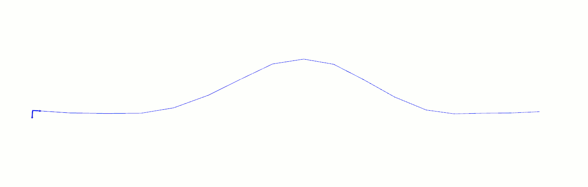

  generateRobotPosesAlongStripper
===

This function generates a succession of robot poses along a line represented by a [vtkStripper](http://www.vtk.org/doc/release/7.0/html/classvtkStripper.html).

The poses are generated using the following pattern : 
- The point 3D position is given by the `vtkStripper`
- The normal Z is obtained using the normal of the reference mesh at the considered point (in the `vtkStripper`)
- The normal X is the vector between the current point of the line and the next one. For the last point the before last direction is used
- The normal Y is the cross product between X and Z

Once the generation of poses is finished, the trajectory obtained is filtered using the function [filterNeighborPosesTooClose](README_filter_neighbor_poses_too_close.md).

The following animation illustrates the generation of the poses :

